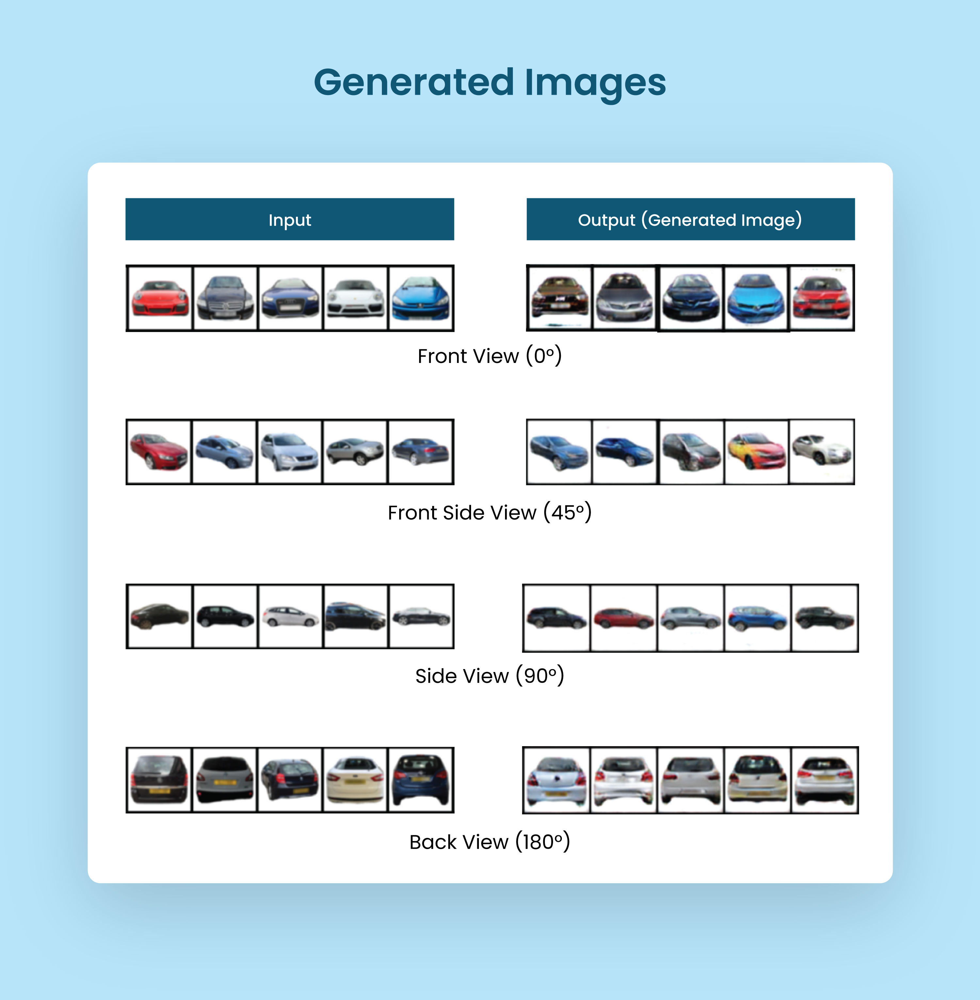

# CapsuleGAN: Using Capsule Network as Discriminator and using ClassCaps as input of Generator in GAN(Generative Adverserial Network)

Here, I am using Capsule Network as a Discriminator and Class Capsules as input to the Generator to generate new Images, and I am then using a DVM-Car dataset to generate new car images using the designed Model. I'll be using DCGAN for comparison the results using FID score.

[Read Final Report](./CapsuleGAN_Final_Report.pdf)



## Methodology & Training


I am taking inspiration from [Kanako Marusaki and Hiroshi Watanabe](https://arxiv.org/abs/2003.08047) and using CapsNet as Discriminator and using the classCaps layer as Input to the Generator along with noise. I’m using a slightly modified version of the DCGAN generator with the number of filters changed and added one flatten layer to flatten classCaps Input. Also, I’m using a more complex network as I’m using three channels compared to only one used by them. And finally, I am using Margin Loss instead of Binary Cross Entropy.

As a dataset, I’m using the [DVM Car dataset](https://deepvisualmarketing.github.io/), a Large- Scale Dataset for Automotive Applications.

For training, I chose a batch size of 128. First, I’m feeding the images to the Discriminator with the class label as true and get the ClassCaps which returns 1x16 (Vector containing Features that represent a car at a particular angle) and calculate discriminator loss using Margin Loss. I then took these vectors and multiplied them with the noise. I’m using the noise of size 100. so I have the final Input of size 100x16 to feed to the Generator. Now in Generator, I’m using one fully connected layer with an output size of 128x8x8(8192), then there is one reshape layer to reshape the feature map to 128x8x8. I’m using BatchNorm and LeakyReLU before feeding it to the TransposedConv2d followed by BatchNorm and ReLU 2 more times, and finally, Tanh activation function to keep the values between (-1,1), and at the end, I have Generated Image of size 3x64x64. Then I feed these generated Images to Discriminator and calculate Margin Loss for Generator. And after all these, there will be BackPropogation using Adam Optimizer with a learning rate of 2e-3.
## Results and Discussion

I’m training this network for two epochs for each car view angle. And I’m also training DCGAN on all different car view angle images for three epochs. And at the end, I’m comparing the results for both of them.

We can see FID Scores here,

| Car Angle | CapsuleGAN     | DCGAN |
| --- | :---: | :---: |
| Front | **120.20968** | 147.08056 |
| Side | 127.76216 | **121.91312** |
| Back | 170.33481 | **151.51725** |
| Front Side | **233.90548** | 322.43786 |

After Reviewing results, I found that Capsule Network has the potential to overcome CNNs, but it still needs some advanced research. If we don’t compare FID scores and just look at how images look, CapsuleGAN generated images are slightly better than DCGAN-generated images. Also, CapsuleGAN learns the distribution quicker than DCGAN; we can see that by looking at the results step by step.

You can check the step by step output images [here](https://drive.google.com/drive/folders/1-0l5O5hcIXTvVbzq9vwbEHrHhkCgCn9W).
## Run Locally

Clone the project

```bash
  git clone https://github.com/rhrahul/CapsuleGAN
```

Go to the project directory

```bash
  cd CapsuleGAN
```

Install Required Python Packages

```bash
  # Installing Pytorch
  pip install torch torchvision 

  # Installing Other Dependencies
  pip install matplotlib pandas numpy
```

Next Download Required Dataset files from [this link](https://drive.google.com/drive/folders/1rofYid3SuvCTr5fqFcDMKiZD8FKBT8_v). You'll see two files named, 
```
resized_DVM_v2.zip
dvm_image_table.csv
```

Extract `resized_DVM_v2.zip` file after downloading it.

You're all set. Open `capsgan_final.ipynb` file and run code block by block.

**Note:** You can also download pretrained weights from [this link](https://drive.google.com/drive/folders/1Kw9W-aRYxqSD2i18ad9rJ2m2yoOxKfaw), and use it to run already trained model.

### `capsgan_final.ipynb` Blocks Structure

- Loading Packages
- Extracting Dataset: Please change file location to your `resized_DVM_v2.zip` location. **Note:** Only use it if you didn't extract the dataset by yourself.
- Declaring Variables with file locations of [dataset](https://drive.google.com/drive/folders/1rofYid3SuvCTr5fqFcDMKiZD8FKBT8_v) and [pretrained weights](https://drive.google.com/drive/folders/1Kw9W-aRYxqSD2i18ad9rJ2m2yoOxKfaw).
- Making function to get images of specified angle of cars.
- Utils: Consists of different layers of Capsule Network.
- CapsGAN Code: Discriminator and Generator Model Building using Capsule Network.
- DCGAN Code
- Loading Data
- Printing the Original Images
- Initializing Both Models
- Train From Scratch
    - CapsuleGAN
    - DCGAN
- Loading Pretrain Models
    - CapsuleGAN
    - DCGAN
- Model Evaluation by Generating New Images
- Comparing Results using FID Score


## References

- https://github.com/jindongwang/Pytorch-CapsuleNet
- The original paper of Capsule Net by Geoffrey Hinton: [Dynamic routing between capsules](https://arxiv.org/abs/1710.09829)
- Whypoolingisnottheanswertoeveryproblem—byabhishekchatter- jee — medium. https://medium.com/@imdeepmind/why-pooling-is-not-the-answer-to-every-problem-6ad23a8d48f0.
- Geoffrey E. Hinton, Alex Krizhevsky, and Sida D. Wang. Transforming auto-encoders. Lecture Notes in Computer Science (including subseries Lecture Notes in Artificial Intelligence and Lecture Notes in Bioinfor- matics), 6791 LNCS(PART 1):44–51, 2011.
- Jingming Huang, Bowei Chen, Lan Luo, Shigang Yue, and Iadh Ounis. DVM-CAR: A large-scale automotive dataset for visual marketing research and applications. (1), 2021.
- Dong Hui Kim. Deep Convolutional GANs for Car Image Generation. 2020.
- Jonathan Krause, Michael Stark, Jia Deng, and Li Fei-Fei. 3d object representations for fine-grained categorization. In 4th International IEEE Workshop on 3D Representation and Recognition (3dRR-13), Sydney, Australia, 2013.
- Alex Krizhevsky, Ilya Sutskever, and Geoffrey E Hinton. Imagenet classification with deep convolutional neural networks. In F. Pereira, C. J. C. Burges, L. Bottou, and K. Q. Weinberger, editors, Advances in Neural Information Processing Systems, volume 25. Curran Associates, Inc., 2012.
- Yann Lecun, Leon Bottou, Yoshua Bengio, and Patrick Ha. LeNet. Proceedings of the IEEE, (November):1–46, 1998.
- Chongxuan Li, Kun Xu, Jun Zhu, and Bo Zhang. Triple generative adversarial nets. Advances in Neural Information Processing Systems, 2017-December:4089–4099, 2017.
- Kanako Marusaki and Hiroshi Watanabe. Capsule GAN Using Capsule Network for Generator Architecture. 2020.
- Alec Radford, Luke Metz, and Soumith Chintala. Unsupervised representation learning with deep convolutional generative adversarial networks. 4th International Conference on Learning Representations, ICLR 2016 - Conference Track Proceedings, pages 1–16, 2016.
- Kruthi N Raj. Capsule Network GAN vs . DCGAN vs . Vanilla GAN for Apparel Image Generation. pages 1947–1971, 2021.
- Raeid Saqur and Sal Vivona. CapsGAN: Using Dynamic Routing for Generative Adversarial Networks. Advances in Intelligent Systems and Computing, 944(Nips):511–525, 2020.
- Mary Steen, Soo Downe, Nicola Bamford, and Leroy Edozien. DenseNet:Densely Connected Convolutional Networks arXiv:1608.06993v5. Arxiv, 28(4):362–371, 2018.
- Jiawei Su, Danilo Vasconcellos Vargas, and Kouichi Sakurai. One Pixel Attack for Fooling Deep Neural Networks. IEEE Transactions on Evolutionary Computation, 23(5):828–841, 2019.

